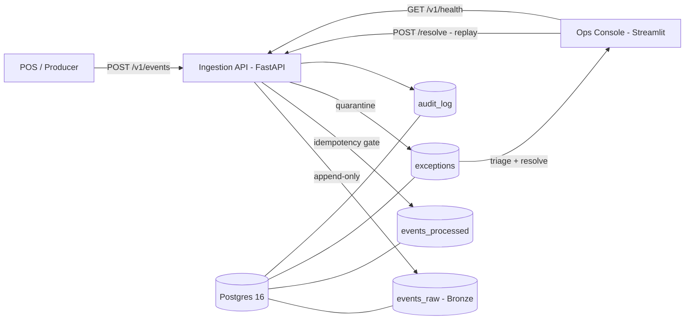

```mermaid
flowchart LR
  POS[POS / Producer] -->|POST /v1/events| API[Ingestion API - FastAPI]
  API -->|append-only| RAW[(events_raw - Bronze)]
  API -->|idempotency gate| EP[(events_processed)]
  API -->|quarantine| EX[(exceptions)]
  API --> AUDIT[(audit_log)]
  EX -->|triage + resolve| OPS[Ops Console - Streamlit]
  OPS -->|POST /resolve - replay| API
  OPS -->|GET /v1/health| API
  DB[(Postgres 16)] --- RAW
  DB --- EP
  DB --- EX
  DB --- AUDIT
```
