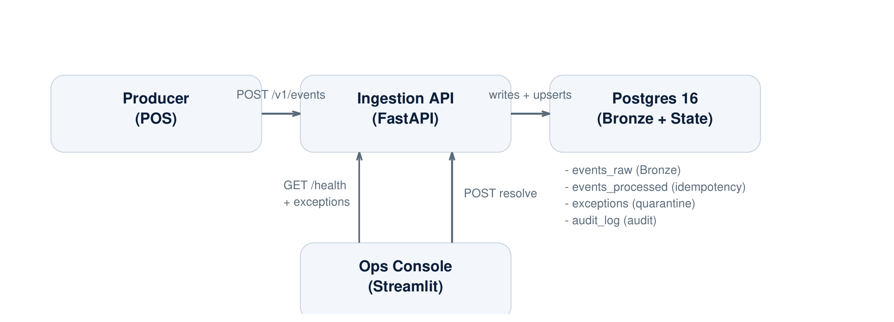

# Ledger-Safe POS Event Ingestion Simulator

A portfolio-grade ingestion system that demonstrates ledger-safe correctness for messy POS and event streams: retries, duplicates, conflicting corrections, quarantine plus operator replay, and operational health signals.

> Trust is the product. If ingestion is wrong, every downstream balance and dashboard is wrong.

## Executive skim (60 to 120 seconds)

**What this proves:**
- Every arrival is captured in Bronze (append-only `events_raw`)
- Idempotency is enforced per tenant plus event ID (`events_processed`)
- Conflicts and unknown types are quarantined (`exceptions`) instead of corrupting the ledger
- Operators can resolve and safely replay (ignore or override) and every action is audited (`audit_log`)
- `/v1/health` exposes ready-to-monitor counters (raw arrivals, open exceptions, idempotency breakdown)

### Live behaviors (when reality hits)

| Scenario | API response | Result |
|---|---:|---|
| First arrival | `201 processed` | Stored in Bronze plus marked processed |
| Duplicate retry (same payload) | `200 duplicate` | Safe, no double-posting |
| Conflicting duplicate (same event_id, different payload) | `202 quarantined` | Exception created with `IDEMPOTENCY_CONFLICT` |
| Unknown event type | `202 quarantined` | Exception created with `UNKNOWN_EVENT_TYPE` |

## Architecture (simple)



<details>
<summary>Mermaid source (optional)</summary>

```text
flowchart LR
  POS[POS / Producer] -->|POST /v1/events| API[Ingestion API - FastAPI]
  API -->|append-only| RAW[(events_raw - Bronze)]
  API -->|idempotency gate| EP[(events_processed)]
  API -->|quarantine| EX[(exceptions)]
  API --> AUDIT[(audit_log)]
  EX -->|triage + resolve| OPS[Ops Console - Streamlit]
  OPS -->|POST /resolve - replay| API
  OPS -->|GET /v1/health| API
  DB[(Postgres 16)] --- RAW
  DB --- EP
  DB --- EX
  DB --- AUDIT
```

</details>
```

## Portable demo (no runtime required)

- LinkedIn carousel PDF: `docs/ledger-safe-carousel.pdf`
- Architecture one-pager: `docs/architecture.md`
- Ops workflow runbook: `docs/ops-runbook.md`

## Screenshots (recommended)

Add images under `docs/assets/` and the repo becomes a skim-friendly demo for reviewers.

Suggested filenames:
- `docs/assets/ops-console-health.png`
- `docs/assets/exceptions-queue.png`
- `docs/assets/idempotency-conflict-detail.png`

Then embed them here in README so exec reviewers do not have to run anything.

## Run locally (1 command)

```powershell
docker compose up -d --build
```

Open:
- API health: http://localhost:8000/v1/health
- Ops console: http://localhost:8501

## 60-second demo script

```powershell
.\demo\run-demo.ps1
```

What you will see:
1. `201 processed` for the first event
2. `200 duplicate` for the exact retry
3. `202 quarantined` plus an `exception_id` for the conflict
4. Ops Console queue increments and detail view shows first vs last payload (for conflicts)

Expected outputs: `demo/expected-output.md`

## Docs

- Architecture: `docs/architecture.md`
- Data model and roadmap: `docs/data-model.md`
- Reason codes catalog: `docs/reason-codes.md`
- Ops workflow runbook: `docs/ops-runbook.md`

## Why this matters (executive view)

Enterprise ingestion fails in predictable ways: retries, duplicates, late events, and conflicting corrections.

If you treat ingestion as best-effort, you eventually ship incorrect balances and incorrect reporting. This project is a small, concrete proof that integration correctness can be designed as an operational product:
- stop silent corruption,
- route ambiguity to quarantine,
- enable controlled replay and backfill,
- keep every decision auditable.

## Roadmap (future phases)

- Silver ledger tables (normalized transaction and reversal model)
- Gold metrics (daily net sales, store performance, reconciliation views)
- Expanded reason codes (schema validation, missing references, cannot-exceed-original)
- Replay and backfill automation and per-tenant health dashboards

## Dev commands

Stop:

```powershell
docker compose down
```

Reset DB (rerun schema init scripts):

```powershell
docker compose down -v
docker compose up -d --build
```
